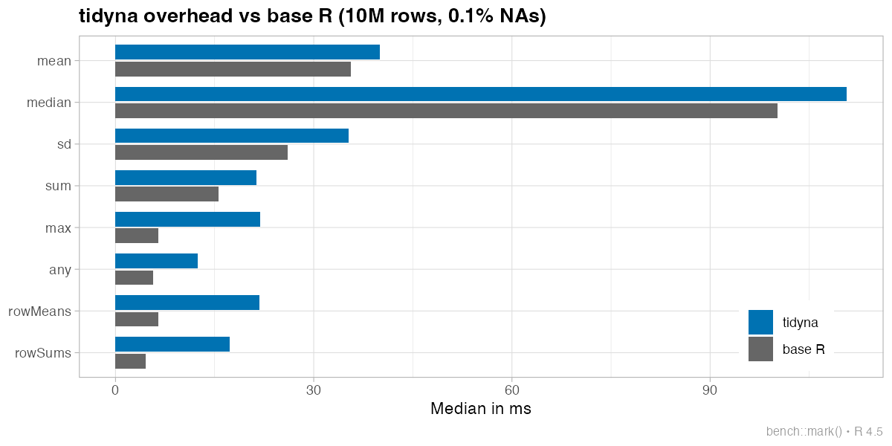

\# tidyna <!-- badges: start --> [](https://CRAN.R-project.org/package=tidyna) [](https://github.com/statzhero/tidyna) [](https://lifecycle.r-lib.org/articles/stages.html#experimental)

<!-- badges: end -->

Tired of littering your code with `na.rm = TRUE`?

**`tidyna`** masks common R functions and warns you when NAs are removed. It handles some special cases. The `table()` default is set to `useNA = "ifany"`.

## Installation

Install from CRAN:

``` r
install.packages("tidyna")
```

Or install the development version from GitHub:

``` r
# install.packages("pak")
pak::pak("statzhero/tidyna")
```

## Usage

``` r
library(tidyna)

x <- c(1, 2, NA)
mean(x)
#> ⚠️ 1 missing value removed.
#> [1] 1.5
```

Suppress warnings with `options(tidyna.warn = FALSE)`.

## Functions

- **Summary**: `mean`, `sum`, `prod`, `sd`, `var`, `median`, `quantile`
- **Extrema**: `min`, `max`, `pmin`, `pmax`, `range`
- **Logical**: `any`, `all`
- **Row-wise**: `rowSums`, `rowMeans`
- **Correlation**: `cor`
- **Table**: `table`

## Special cases

**All-NA input is configurable**: By default, tidyna throws an error when all values are NA to prevent misleading values like `Inf`, `NaN`, or `0`:

``` r
base::sum(c(NA, NA), na.rm = TRUE)
#> [1] 0

sum(c(NA, NA))
#> Error in `sum()`:
#> ! All values are NA; check if something went wrong.
```

You can change this behavior with the `all_na` argument or the `tidyna.all_na` option:

``` r
# Return base R behavior (NaN, Inf, 0, etc.)
sum(c(NA, NA), all_na = "base")
#> [1] 0

# Always return NA
sum(c(NA, NA), all_na = "na")
#> [1] NA
```

**`rowSums`/`rowMeans`** return `NA` for all-NA rows, but error if the entire matrix is NA. Also configurable via `all_na`.

**`pmax`/`pmin`** return `NA` for positions where all inputs are NA (with a warning), but error if every position is all-NA. Also configurable via `all_na`.

**`cor`** defaults to `use = "pairwise.complete.obs"` instead of erroring on NAs.

**`table`** defaults to `useNA = "ifany"`, showing NA counts when present rather than silently dropping them.

## Performance

There is no free lunch. The `tidyna` package adds some overhead:



For most functions like `mean()` the overhead is negligible (1.1x). But `rowMeans()` and `rowSums()` require an extra pass to detect all-NA rows, so there is a substantial loss (3-4x).

I'm still working on whether the memory allocation needs to be addressed.

## Roadmap

- Add explicit `_aware` suffixed versions (`mean_aware`, `sum_aware`, etc.) for users who prefer not to mask base functions.

## Related packages

- [naflex](https://cran.r-project.org/package=naflex): Conditional NA removal based on thresholds
- [na.tools](https://cran.r-project.org/package=na.tools): Utilities for working with missing values